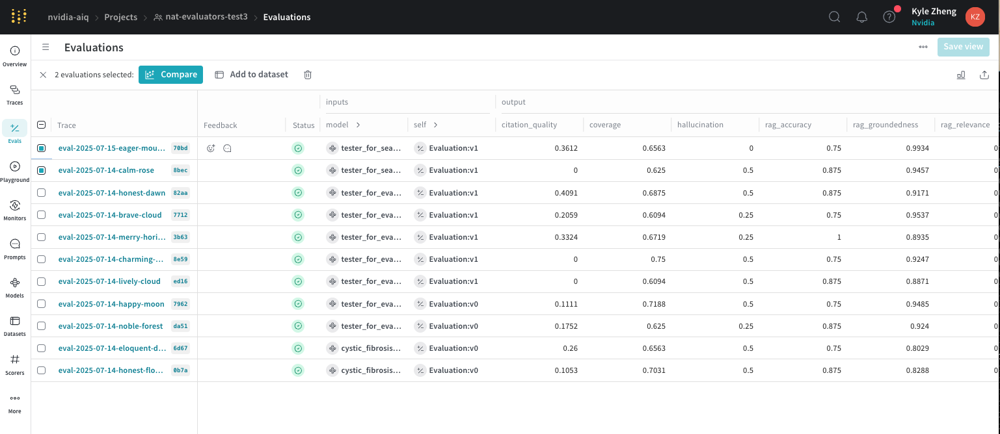

<!--
SPDX-FileCopyrightText: Copyright (c) 2025, NVIDIA CORPORATION & AFFILIATES. All rights reserved.
SPDX-License-Identifier: Apache-2.0

Licensed under the Apache License, Version 2.0 (the "License");
you may not use this file except in compliance with the License.
You may obtain a copy of the License at

http://www.apache.org/licenses/LICENSE-2.0

Unless required by applicable law or agreed to in writing, software
distributed under the License is distributed on an "AS IS" BASIS,
WITHOUT WARRANTIES OR CONDITIONS OF ANY KIND, either express or implied.
See the License for the specific language governing permissions and
limitations under the License.
-->

# AIQ AIRA Evaluation Suite

A complete evaluation framework for AI Research Assistant (AIRA) workflows, featuring **automatic dataset preprocessing** and comprehensive assessment of AI-generated research reports.


### Automatic Dataset Preprocessing
The evaluation suite now **automatically generates missing evaluation fields** from your dataset:
- **Context Relevance Questions**: Generates targeted questions for evaluating retrieved contexts
- **Coverage Facts/Claims**: Extracts key facts from ground truth for coverage assessment
- **Skip Workflow Hack**: You can upload a dataset that already includes these fields, and the system will automatically detect them in the workflow, so no additional steps are required on your part.


## Prerequisites & Dependencies

### Required Versions
- **Python 3.12+**

### Dependency Management
If you encounter dependency conflicts, reference the tested dependency versions from the NeMo-Agent-Toolkit project:
- **Reference**: https://github.com/NVIDIA/NeMo-Agent-Toolkit/blob/develop/uv.lock

### API Keys Required
- `NVIDIA_API_KEY` - For LLM access
- `TAVILY_API_KEY` - For web search (optional)
- `WANDB_API_KEY` - For Weave tracing (optional)

## Quick Start

### 1. Branch Checkout
After cloning the repository, make sure to checkout to the correct branch:

```bash
git clone <repository-url> 
cd into it
git checkout <branch-name>
```

### 2. Installation

#### Development Installation (Recommended)
For local development, use [uv](https://docs.astral.sh/uv/getting-started/installation/) for better dependency management:

```bash
# Install uv if not already installed
curl -LsSf https://astral.sh/uv/install.sh | sh

# Create virtual environment with Python 3.12
uv python install 3.12
uv venv --python 3.12 --python-preference managed
Activate with: source .venv/bin/activate
# Install AIRA package in development mode
uv pip install -e ".[dev]" --prerelease=allow
```


#### Standard Installation
```bash
# Install AIRA package
pip install -e .
```


### 2. Set Environment Variables

```bash
export NVIDIA_API_KEY="your_nvidia_api_key" # Preferably one from nvidia build
export TAVILY_API_KEY="your_tavily_api_key"  # Optional for web search
export WANDB_API_KEY="your_wandb_api_key" # Optional, there are more instructions below if you want to set up tracing to w&b weave
```

### 3. Run Evaluation

```bash

# Full workflow + evaluation (requires RAG server) + AIRA Instruct LLM
uv run nat eval --config_file configs/eval_config.yml 
```
### 4. Run Evaluation saving it to .txt file 

```bash

# I would recommend running with > output.txt 2>&1 to better analyze the log statements / any errors
uv run nat eval --config_file configs/eval_config.yml > output.txt 2>&1
```


## Dataset Requirements

### Minimal Dataset Format
Your dataset only needs these basic fields - **the system will automatically generate the rest**:

```json
[
  {
    "id": "example_1",
    "topic": "Write a report about...",
    "report_organization": "Executive Summary, Analysis, Conclusions",
    "reflection_count": 3,
    "num_queries": 3,
    "llm_name": "nemotron",
    "search_web": false,
    "rag_collection": "Biomedical_Dataset",
    "report_size": "Small",
    "ground_truth": "Your reference report content here..."
  }
]
```

**After Automatic Preprocessing:**
```json
{
  "id": "cystic_fibrosis_1",
  "topic": "Write a report about cystic fibrosis...",
  "ground_truth": "Cystic fibrosis is an inherited disease...",
  "context_relevance_questions": [
    {
      "question": "What role do airway epithelial cells play?",
      "rationale": "Understanding epithelial cell function is crucial...",
      "aspect": "Airway epithelial cells"
    }
  ],
  "coverage_facts_claims": [
    "Cystic fibrosis is an inherited disease that leads to thick mucus",
    "Neutrophils release powerful enzymes that harm lung tissue"
  ]
}
```

## Configuration

### Main Configuration File
Use `configs/eval_config.yml` as your starting point:

```yaml
# LLM Configuration
llms:
  eval_llm:
    _type: openai
    model_name: meta/llama-3.1-70b-instruct
    base_url: https://integrate.api.nvidia.com/v1
    api_key: ${NVIDIA_API_KEY}

# Dataset Configuration
general:
  dataset:
    file: "data/eval_dataset.json"  # Your minimal dataset or it could be a fully processed one either works

# Workflow Configuration with Preprocessing
workflow:
  _type: aira_evaluator_workflow
  generator:
    _type: full
    fact_extraction_llm: meta/llama-3.1-70b-instruct  # LLM for preprocessing
    verbose: true  # Enable detailed logging

# Evaluation Configuration
eval:
  general:
    output_dir: ./.tmp/aiq_aira/
    cleanup: true
  evaluators:
    coverage:
      _type: coverage
      llm: eval_llm
    synthesis:
      _type: synthesis
      llm: eval_llm
```

## Setting Up Weave Tracing (Currently need to request weave access, contact Michael Demoret for enterprise weave access)

To enable Weights & Biases Weave for experiment tracking and observability:

### 1. Configure Weights & Biases
```bash
# Set your Weights & Biases API key
export WANDB_API_KEY=<your_api_key>

# Login to wandb
wandb login
```

### 2. Reinstall Package (if necessary)
```bash
uv pip install -e "./aira[dev]"
```

### 3. Enable Weave Tracing in Your Config File

**By default, Weave tracing is disabled (commented out) in `configs/eval_config.yml`**. To enable it:

1. **Open `configs/eval_config.yml`**
2. **Find the commented Weave configuration** (around lines 48-52):
   ```yaml
   # Uncomment this if you want to use W&B Weave for tracing
     # tracing:
     #   weave:
     #     _type: weave
     #     project: "NAT-BP-Project-Default"
   ```

3. **Uncomment the tracing section** and customize your project name:
   ```yaml
   # Uncomment this if you want to use W&B Weave for tracing
   tracing:
     weave:
       _type: weave
       project: "your-project-name"  # Change this to your desired project name
   ```

4. **Add a workflow alias** in the eval section for better organization:
   ```yaml
   eval:
     general:
       workflow_alias: "my_experiment_name"  # This will label your evaluation in Weave
       output_dir: .tmp/aiq_aira
   ```

### 4. Run the evaluation the same. You should see 

**Important**: The `workflow_alias` determines how your evaluation runs will be labeled and organized in Weave. Use descriptive names like:
- `"baseline_experiment"`
- `"v2_with_reflection"`  
- `"cystic_fibrosis_eval"`

**Information Tracked on Weave**: Weave will track your evaluation metrics (citation quality, etc.) for each individual run. Additionally, it will also contain information about your dataset and configuration information such as the llm_type that you used to run certain portions of your experiment allowing for better comparsions.

**Reference the official documentation**: [Observing a Workflow with W&B Weave](https://docs.nvidia.com/nemo/agent-toolkit/1.2/workflows/observe/observe-workflow-with-weave.html)




### Key Configuration Options

- **`fact_extraction_llm`**: LLM used for generating missing evaluation fields
- **`verbose`**: Enable detailed logging to see preprocessing progress
- **`output_dir`**: Where evaluation results are saved

### Citation Pairing LLM Configuration

The `citation_pairing_llm` setting controls which model pairs facts with citations. **Llama models struggle with citation pairing**, so GPT models are recommended:

**Option 1: Use GPT models (Recommended)**
```yaml
workflow:
  generator:
    citation_pairing_llm: gpt-4o-20241120  # Default, good performance. High chance to see rate limiting when using llm_gateway. If you do I would recommend switching to the mistral model(nvdev/mistralai/mixtral-8x22b-instruct-v0.1) over any llama model for this task
```

**Option 2: Use NVIDIA models**
```yaml
workflow:
  generator:
    citation_pairing_llm: mistralai/mixtral-8x22b-instruct-v0.1
```
**Uses existing:** `NVIDIA_API_KEY` (no additional setup required)


## Available Evaluators

The suite includes comprehensive evaluators for research report quality:

### Core Evaluators
- **Coverage**: Measures how well the report covers key facts from ground truth
- **Synthesis**: Evaluates integration of information from multiple sources  
- **Hallucination**: Detects unsupported claims in generated reports
- **Citation Quality**: Validates accuracy and relevance of citations


### Custom Evaluators with Dual Template Evaluation

The following custom evaluators use **dual template evaluation** for robustness:

#### Hallucination Evaluator
- **Dual Template Evaluation**: Uses two different prompt templates to evaluate hallucinations
- **Rating Scale**: 0 (no hallucination) to 1 (hallucination detected)
- **Final Score**: Average of both template scores

#### Synthesis Evaluator
- **Dual Template Evaluation**: Uses two different prompt templates to evaluate synthesis quality
- **Rating Scale**: 0 (pure extraction) to 4 (expert synthesis)
- **Final Score**: Average of both template scores, normalized to 0-1 scale

#### Coverage Evaluator
- **Single Template Evaluation**: Uses one template to evaluate fact coverage
- **Rating Scale**: 0 (not covered) to 1 (covered)

#### Citation Quality Evaluator
- **Citation Verification**: Uses RAGAS ResponseGroundedness to verify if facts are supported by cited sources
- **Scoring Method**: Calculates precision, recall, and F1 scores based on citation validity (threshold 0.5)
- **Final Score**: F1 score between 0 and 1, where 1 indicates perfect citation quality


### RAGAS Integration
- **Context Relevance**: How relevant retrieved contexts are to the query
- **Answer Accuracy**: Factual correctness compared to ground truth
- **Groundedness**: Whether responses are supported by retrieved contexts

**How it works:**
- The RAGAS metrics returns a score from 0 to 1 using the standard RAGAS libarary implementation

  
### Common Issues

1. **Import Errors**: Ensure both packages are installed in development mode (`pip install -e .`)
2. **API Key Issues**: Verify environment variables are set correctly
3. **RAG Server Connection**: Check `rag_url` in config matches your server


## Eval Project Structure 

```
aiq-internal-notebook/
├── aira/                      # AIRA workflow package
│   ├── src/aiq_aira/
│   │   ├── functions/         # Core function implementations (generate_summary, ...)
│   │   └── eval/              # Evaluation harness (what this doc focuses on)
│   │       ├── generators/
│   │       │   ├── generate_full.py      # Main end-to-end generator
│   │       │   └── extraction_utils.py   # Pre-processing helpers
│   │       ├── evaluators/    # Built-in evaluators
│   │       │   ├── coverage_evaluator.py
│   │       │   ├── synthesis_evaluator.py
│   │       │   ├── hallucination_evaluator.py
│   │       │   ├── citation_quality_evaluator.py
│   │       │   └── ragas_wrapper_evaluator.py
│   │       ├── generator_register.py     # Registers generator entry-points
│   │       ├── evaluator_register.py     # Registers evaluator entry-points
│   │       └── schema.py                 # Pydantic data models
│   └── test_aira/             # Unit / integration tests
├── configs/                   # YAML configuration files (e.g. eval_config.yml)
├── data/                      # Example dataset (eval_dataset.json, sample zips)
├── notebooks/                 # Jupyter notebooks (aira_evaluation tutorial here)
├── docs/                      # Markdown docs (this file, API guides, etc.)
├── ci/                        # CI helper scripts
└── pyproject.toml             # Project dependencies & build config
```

## Implementing a Custom Evaluator

Adding your own custom evaluator to the AIRA evaluation suite is a straightforward process. Follow these steps to integrate your own evaluation logic:

### 1. Create the Evaluator Class

First, create a new Python file for your evaluator (e.g., `my_custom_evaluator.py`) inside `aira/src/aiq_aira/eval/evaluators/`. Your class should inherit from a base class or implement the required `evaluate` method.

```python
# aira/src/aiq_aira/eval/evaluators/my_custom_evaluator.py
from aiq.builder.evaluator import EvaluatorBase, EvaluationOutput

class MyCustomEvaluator(EvaluatorBase):
    async def evaluate(self, workflow_output, **kwargs) -> EvaluationOutput:
        # Your evaluation logic here
        score = 0.95
        return EvaluationOutput(
            evaluator=self.config.name,
            metric="custom_metric",
            value=score
        )
```

### 2. Define the Configuration

Next, define a configuration class for your evaluator. This class should inherit from `EvaluatorBaseConfig` and include a unique `name` for your evaluator.

```python
# In the same file
from aiq.data_models.evaluator import EvaluatorBaseConfig

class MyCustomEvaluatorConfig(EvaluatorBaseConfig, name="my_custom_evaluator"):
    # Add any custom configuration fields here
    pass
```

### 3. Register the Evaluator

Now, you need to register your new evaluator so that the AIQ Toolkit can discover it. In `aira/src/aiq_aira/eval/evaluator_register.py`, add the following:

-   Import your new evaluator and its config.
-   Create a registration function using the `@register_evaluator` decorator.

```python
# aira/src/aiq_aira/eval/evaluator_register.py

# ... existing imports
from aiq_aira.eval.evaluators.my_custom_evaluator import MyCustomEvaluator, MyCustomEvaluatorConfig

@register_evaluator(config_type=MyCustomEvaluatorConfig)
async def register_my_custom_evaluator(config: MyCustomEvaluatorConfig, builder: EvalBuilder):
    evaluator = MyCustomEvaluator(config=config)
    yield EvaluatorInfo(config=config, evaluate_fn=evaluator.evaluate)
```

### 4. Add to the Evaluation Config

Finally, add your new evaluator to the `eval_config.yml` file under the `evaluators` section.

```yaml
# aira/configs/eval_config.yml
eval:
  evaluators:
    # ... other evaluators
    my_custom_evaluator:
      _type: my_custom_evaluator
```

### 5. Reinstall the Package

To ensure all your changes are picked up, reinstall the `aiq_aira` package in editable mode:

```bash
uv pip install -e "./aira[dev]" --prerelease=allow
```

That's it! You can now run the evaluation, and your custom evaluator will be included in the process. Please reach out to Kyle Zheng if there are any questions

## Developer Workflow

### 1. Create Your Dataset
```json
[
  {
    "id": "my_experiment_1", 
    "topic": "Your research topic here...",
    "ground_truth": "Your reference content...",
    "report_organization": "Introduction, Analysis, Conclusion",
    "num_queries": 3,
    "llm_name": "nemotron",
    "search_web": false,
    "rag_collection": "Your_Collection",
    "reflection_count": 2
  }
]
```

### 2. Update Configuration
```yaml
general:
  dataset:
    file: "path/to/your/dataset.json"

workflow:
  generator:
    verbose: true  # See preprocessing & other logs in action
```

### 3. Run Evaluation
```bash
uv run aiq eval --config_file aira/configs/eval_config.yml
```

### 4. Check Results

After running the evaluation, you'll find the results in the output directory (typically `.tmp/aiq_aira/`):

```
./.tmp/aiq_aira/
├── workflow_output.json         # Generated data (with preprocessing)
├── coverage_output.json         # Coverage evaluation results
├── synthesis_output.json        # Synthesis evaluation results
└── ...
```

**Example Output Files**: For reference on what to expect from a full end-to-end evaluation, see the [example workflow output files](example-workflow-output/) which demonstrate the typical structure and content of evaluation results.


## Troubleshooting

### Common Issues

**"No context_relevance_questions found" but they exist**:
- Check that the field contains actual data, not empty lists
- Verify JSON structure is correct

**Preprocessing takes too long**:
- Use a faster LLM model for `fact_extraction_llm`
- Reduce ground truth content length

**API rate limits**:
- The system automatically handles retries
- Consider using a different model endpoint

**Missing evaluation fields after preprocessing**:
- Check API key is valid
- Enable `verbose: true` to see detailed logs
- Verify LLM model name is correct

**Profiling error with `--skip_workflow`**:
```
ValueError: DataFrame is missing required columns: {'example_number', 'event_timestamp'}
```
- **Cause**: Profiler tries to compute workflow runtime metrics when no workflow was run
- **Solution**: Disable profiling in your config:
  ```yaml
  eval:
    general:
      profiler:
        base_metrics: false  # Disable when using --skip_workflow
  ```

Enable verbose logging (turn this off if you get too much logs):

```yaml
workflow:
  generator:
    verbose: true
```

This shows:
- Preprocessing progress
- Generated question/fact counts
- LLM call details
- Timing information

## Performance Tips

1. **Choose appropriate LLM models** - faster models for preprocessing, higher quality for evaluation. Would suggest using mistral for RAGAS metrics they provide much better variability than the llama models on build from my experience
2. **Use skip_workflow mode** (`--skip_workflow`) for faster iteration during development if you already have a workflow done running
3. **Batch similar experiments** to minimize setup overhead

The preprocessing system is designed to be extensible - you can easily add new evaluation fields by following the existing patterns in `extraction_utils.py`.

## License

Apache 2.0 - See LICENSE file for details.
